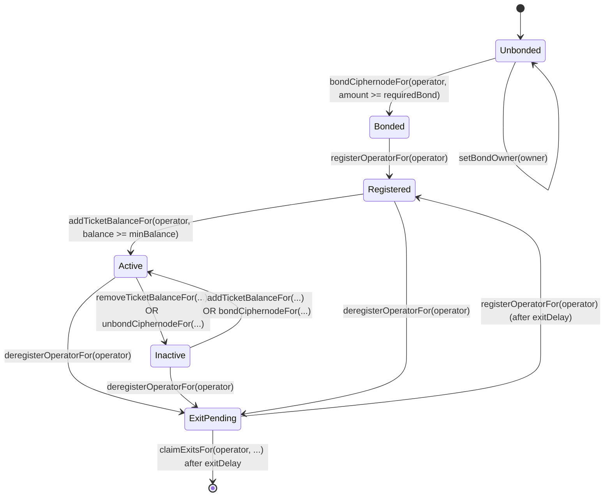

# Ciphernode Operators

Ciphernodes are the distributed workers that power the Interfold network. They participate in
threshold cryptography to enable encrypted execution environments (E3s) while ensuring no single
party can access the underlying plaintext data.

> **Interactive setup:** the dashboard has a step-by-step operator guide. It reads the live bonding
> registry and sends each on-chain step from your wallet. Open
> [Run a ciphernode](https://dashboard.theinterfold.com/#operator).

## What is a Ciphernode?

A ciphernode is a node operator that:

- **Generates key shares**: Creates PVSS (Publicly Verifiable Secret Sharing) key shares for each
  committee
- **Publishes public keys**: Contributes to aggregated committee public keys used for encryption
- **Produces decryption shares**: Decrypts computation outputs when the threshold is met
- **Maintains availability**: Stays online and responsive to participate in sortition and committee
  duties

Ciphernodes earn rewards for successful participation and risk slashing for missed duties or
malicious behavior.

## Contract Architecture

The Interfold protocol uses several contracts that work together:

| Contract                 | Purpose                                                                          |
| ------------------------ | -------------------------------------------------------------------------------- |
| **Interfold**            | Core coordinator that manages E3 requests and computation lifecycle              |
| **CiphernodeRegistry**   | Tracks registered operators and manages committee formation                      |
| **BondingRegistry**      | Handles ciphernode bonds (FOLD) and ticket balances (tFOLD)                      |
| **SlashingManager**      | Processes slashing proposals, appeals, and ban enforcement                       |
| **E3RefundManager**      | Calculates and distributes refunds when an E3 fails                              |
| **InterfoldToken**       | FOLD token used for ciphernode bonding                                           |
| **InterfoldTicketToken** | Non-transferable tFOLD token representing ticket balances (backed by stablecoin) |

### Sepolia Contract Addresses

| Contract              | Address                                      | Deploy block |
| --------------------- | -------------------------------------------- | ------------ |
| Interfold             | `0x3Cd771d8B8677Bcb1e3338AdDF8A887CCc2C3768` | 11507472     |
| CiphernodeRegistry    | `0x6c54Fe8d70476Ab87ef845aD669E91f66CdfCA8d` | 11507360     |
| BondingRegistry       | `0x43bA4663385b5F20f79c04AA8CD48694426863F0` | 11507361     |
| SlashingManager       | `0xfd1A11dd95161313A447e6465f9c2793Dda7bCa1` | 11507357     |
| E3RefundManager       | `0xd922819B501a3e7A35919101E5E072701e0aB1C1` | 11507475     |
| InterfoldTicketToken  | `0x439a7A069Fb1Dae5eb6B39E0502A1f05E48FDd5b` | 11507354     |
| InterfoldToken (FOLD) | `0x0709a074be7A8068b2bb4860F992d8111Fbb2f7a` | 11507370     |
| MockUSDC (fee token)  | `0xEd12306AF0Cd3D2170cb3E752A653A9143C60a83` | 11507353     |
| Faucet                | `0x2A9D8bf02b119Ceb21d3343F7b7F84a7cF1Cc8aC` | 11507376     |

### Proof Verification

> **The current Sepolia deployment does not verify proofs.** It was deployed with
> `DEPLOY_MOCKS=true` and without `ENABLE_ZK_VERIFICATION`, so the verifier addresses below are
> mocks that accept any proof. Use this network to wire up and operate a node, not to test proving
> correctness.

| Mock contract          | Address                                      | Deploy block |
| ---------------------- | -------------------------------------------- | ------------ |
| MockE3Program          | `0xB8afcb05eCdd12B95e1C982b21866d437c8d36f6` | 11507465     |
| MockComputeProvider    | `0xC329d7E8458092Db3A32b09FaC7E5013bC89a4DD` | 11507381     |
| MockDecryptionVerifier | `0x11E65F893FC8cbf5306383080e4c859737C9Bf59` | 11507382     |
| MockCiphertextVerifier | `0x9549035278Db50DB824ecd42B92aB9aDB19aa071` | 11507383     |
| MockPkVerifier         | `0xeda744139FE4ddd43450428198DBCa2053F1ED90` | 11507384     |

`interfold config check` reports this too, so you do not have to remember which deployment you are
pointed at.

On a deployment built with `ENABLE_ZK_VERIFICATION`, these mocks are replaced by the DKG and
decryption aggregator circuits, which are the sole on-chain verifiers for BFV public-key publication
and plaintext decryption respectively (each aggregator internally verifies the underlying
node-fold/C5 and C6-fold/C7 sub-proofs). Their addresses appear in `deployed_contracts.json` as
`DkgAggregatorVerifier` and `DecryptionAggregatorVerifier`; neither is present on Sepolia today.

> Always verify addresses from `packages/interfold-contracts/deployed_contracts.json` or your
> deployment output. Addresses differ per network.

### BondingRegistry Operator Functions

The CLI and the dashboard both call these functions. Use this table when you integrate directly
against `BondingRegistry`.

| Function                                                | Caller                 | Purpose                                                  |
| ------------------------------------------------------- | ---------------------- | -------------------------------------------------------- |
| `setBondOwner(bondOwner)`                               | Operator key           | Authorize the wallet that controls this position         |
| `proposeBondOwner(operator, newOwner)`                  | Bond owner             | Nominate a replacement owner                             |
| `acceptBondOwner(operator)`                             | Nominated owner        | Accept the position and move the FOLD accounting         |
| `bondCiphernodeFor(operator, amount)`                   | Bond owner             | Bond FOLD from the caller's wallet                       |
| `unbondCiphernodeFor(operator, amount)`                 | Bond owner             | Queue bonded FOLD for exit                               |
| `registerOperatorFor(operator)`                         | Bond owner             | Add the operator key to the ciphernode registry          |
| `deregisterOperatorFor(operator)`                       | Bond owner or operator | Request deregistration and queue all collateral          |
| `addTicketBalanceFor(operator, amount)`                 | Bond owner             | Deposit the fee token and mint tickets                   |
| `removeTicketBalanceFor(operator, amount)`              | Bond owner             | Burn tickets and queue the underlying for exit           |
| `claimExitsFor(operator, maxTicket, 0)`                 | Anyone                 | Settle matured tickets to the bond owner                 |
| `claimExitsFor(operator, maxTicket, maxCiphernodeBond)` | Bond owner             | Claim matured tickets and ciphernode bond collateral     |
| `refreshOperatorStatus(operator)`                       | Anyone                 | Recompute one operator's status under the current policy |
| `refreshOperatorStatuses(operators)`                    | Anyone                 | Recompute a batch of operators                           |

Read the current state with these view functions:

| View                           | Returns                                                           |
| ------------------------------ | ----------------------------------------------------------------- |
| `bondOwnerOf(operator)`        | Wallet that controls the collateral, or the zero address if unset |
| `pendingBondOwnerOf(operator)` | Wallet nominated to accept the position                           |
| `getCiphernodeBond(operator)`  | Active ciphernode bond                                            |
| `isCiphernodeBonded(operator)` | Whether the bond meets the active-maintenance floor (see below)   |
| `isRegistered(operator)`       | Whether the key is in the registry                                |
| `isActive(operator)`           | Whether the operator is eligible for sortition                    |
| `availableTickets(operator)`   | `floor(ticketBalance / ticketPrice)`                              |
| `totalBonded(account)`         | FOLD that counts toward the locked-floor collateral of an owner   |
| `hasExitInProgress(operator)`  | Whether an exit is queued                                         |

> `isCiphernodeBonded` and registration use different thresholds. `isCiphernodeBonded` tests the
> active-maintenance floor, which is `requiredCiphernodeBond` multiplied by
> `ciphernodeBondActiveBps` (80% by default). `registerOperatorFor` requires the full
> `requiredCiphernodeBond`. An operator between the two reads as bonded but cannot register: the
> call reverts with `NotCiphernodeBonded()`. Compare `getCiphernodeBond` against
> `requiredCiphernodeBond` to test whether an operator can register.

> `refreshOperatorStatus` is permissionless, but the operator must be registered. The call reverts
> with `NotRegistered()` for an operator that is not in the registry. `refreshOperatorStatuses`
> reverts if any operator in the list is not registered. Governance changes to the ticket price, the
> required bond, or the minimum ticket balance invalidate cached status. Call this function to
> restore the correct status for an operator.

## Operator Lifecycle

A ciphernode moves through several states during its lifecycle:

### State Descriptions

| State           | Description                                                                        |
| --------------- | ---------------------------------------------------------------------------------- |
| **Unbonded**    | No ciphernode bond deposited; cannot register                                      |
| **Bonded**      | FOLD bonded but not yet registered in the registry                                 |
| **Registered**  | In the registry but lacking minimum ticket balance                                 |
| **Active**      | Fully operational; eligible for committee selection via sortition                  |
| **Inactive**    | Registered but below minimum requirements (tickets or ciphernode bond)             |
| **ExitPending** | Deregistration requested; waiting for exit delay before claiming or re-registering |

## Requirements

Before operating a ciphernode, ensure you have:

| Requirement     | Details                                                                                    |
| --------------- | ------------------------------------------------------------------------------------------ |
| **FOLD Tokens** | At least `100 FOLD` for the ciphernode bond (check `requiredCiphernodeBond()`)             |
| **Stablecoin**  | USDC (or configured fee token) for tickets; minimum 1 ticket worth                         |
| **ETH**         | Gas for transactions on your target network                                                |
| **Hardware**    | Linux/macOS, 8+ cores, 32GB+ DDR5 RAM, 500GB+ NVMe SSD, stable internet with open UDP port |
| **Software**    | Interfold CLI installed, WebSocket RPC endpoint                                            |

## Getting Started

Follow these guides in order to become an active ciphernode operator:

1. **[Running a Ciphernode](./running)** - Set up your node using DappNode, Interfold CLI, or Docker
2. **[Registration & Bonding](./registration)** - Bond your ciphernode bond, register, and add
   tickets
3. **[Tickets & Sortition](./tickets-and-sortition)** - Understand how committee selection works
4. **[Exits, Rewards & Slashing](./exits-and-slashing)** - Learn about rewards and exit procedures

To do the on-chain steps in a browser instead of the CLI, use the
[interactive operator guide](https://dashboard.theinterfold.com/#operator) on the dashboard.
